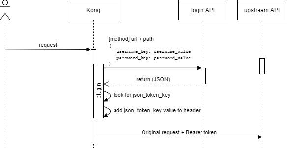

# Optare Solutions - Kong Body request Auth

This plugin performs authentication via a request to an authentication endpoint that
* Receives the credentials in atributes of the body
* Return a token in an attribute of the response

The token is added to the request as Bearer Authentication.



## References

This project is losely based on https://github.com/be-humble/kong-ext-auth

## Setup plugin

Check plugin [schema](./kong/plugins/bodyrequest-auth/schema.lua) for detailed info.

Plugin logs are at warn level but disabled by default. If you want the plugin to show logs add the config property:
```
log_enabled: true
```

### Config using k8s

Here is a sample:
```
apiVersion: configuration.konghq.com/v1
kind: KongPlugin
metadata:
  name: bodyrequest-auth-plugin
  namespace: test
config:
  url: https://authentication-host
  path: /my-authentication-api/v1/login
  method: POST
  json_token_key: my-token-id
  username_value: AAAA
  password_value: BBBB
plugin: bodyrequest-auth
```

#### Using secrets

As proposed in this discussion: https://discuss.konghq.com/t/kong-plugin-config-with-secret/6986/2

There is sensible information in the config (like provider credentials) so we can use a secret to store it.

Kong plugins in this version don't allow us to get each config property from a different source. So all the config must be stored in a secret
```
apiVersion: v1
kind: Secret
metadata:
  name: auth-test-secret
  namespace: test
stringData:
  bodyrequest-config: |
    url: https://authentication-host
    path: /my-authentication-api/v1/login
    method: POST
    json_token_key: my-token-id
    username_value: AAAA
    password_value: BBBB
type: Opaque
```

And we must use the secret as our config source:
```
apiVersion: configuration.konghq.com/v1
kind: KongPlugin
metadata:
  name: bodyrequest-auth-plugin
  namespace: test
configFrom:
  secretKeyRef:
    name: auth-test-secret
    key: bodyrequest-config
plugin: bodyrequest-auth
```

### Settings in kong

If we get this error when performing the login process:

```
"20: unable to get local issuer certificate"
```

We must add SSL certificate variables to our kong deployment

alpine based kong image:
```
KONG_LUA_SSL_TRUSTED_CERTIFICATE=/etc/ssl/cert.pem
KONG_LUA_SSL_VERIFY_DEPTH=2
```

centos based kong image:
```
KONG_LUA_SSL_TRUSTED_CERTIFICATE=/etc/pki/tls/cert.pem
KONG_LUA_SSL_VERIFY_DEPTH=2
```

For more information please refer to https://discuss.konghq.com/t/kong-log-error-about-certificate/6371/6

### Build Lua rock

In pongo shell
```
cd /kong-plugin/
luarocks make
luarocks pack kong-plugin-bodyrequest-auth 1.0.0
# Set propper version
```

## Priority
By default, the priority of the plugin is 900. You can change it using an environment variable:
```
BODYREQUEST_AUTH_PRIORITY=1000
```

## Test local

### Start pongo

Follow documentation
* https://konghq.com/blog/custom-lua-plugin-kong-gateway/
* https://github.com/Kong/kong-pongo

First time we must follow first link to prepare the env.

> NOTE: I found an issue working with Docker modules in windows. You might need to remove some lines from pongo file.

Next time we work with pongo we only need to execute:
```
PATH=$PATH:~/.local/bin
pongo run
```

Start/stop
```
pongo run

pongo down
```

### Access pongo shell

```
pongo shell
```

### In pongo cmd

```
kong migrations bootstrap --force
kong start

#check
curl -i http://localhost:8000/
```

Enable a service and route
```
curl -i -X POST \
    --url http://localhost:8001/services/ \
    --data 'name=example-service' \
    --data 'url=http://konghq.com'

curl -i -X POST \
    --url http://localhost:8001/services/example-service/routes \
    --data 'hosts[]=example.com'
```

Add plugin to service
```
curl -i -X POST \
    --url http://localhost:8001/services/example-service/plugins/ \
    --data 'name=bodyrequest-auth' \
    --data 'config.url=https://authentication-host' \
    --data 'config.path=/my-authentication-api/v1/login' \
    --data 'config.method=POST' \
    --data 'config.json_token_key=my-token-id' \
    --data 'config.username_value=AAAAAA' \
    --data 'config.password_value=BBBBBB' \
    --data 'config.log_enabled=true'

#check
curl -i -H "Host: example.com" http://localhost:8000/
```

Remove plugin (to add it again with different config)
```
# Find plugin id
curl http://localhost:8001/plugins

# Delete by ID
curl -X DELETE http://localhost:8001/plugins/3fbfb590-c13f-4fa4-8901-619f96852e6f
```
